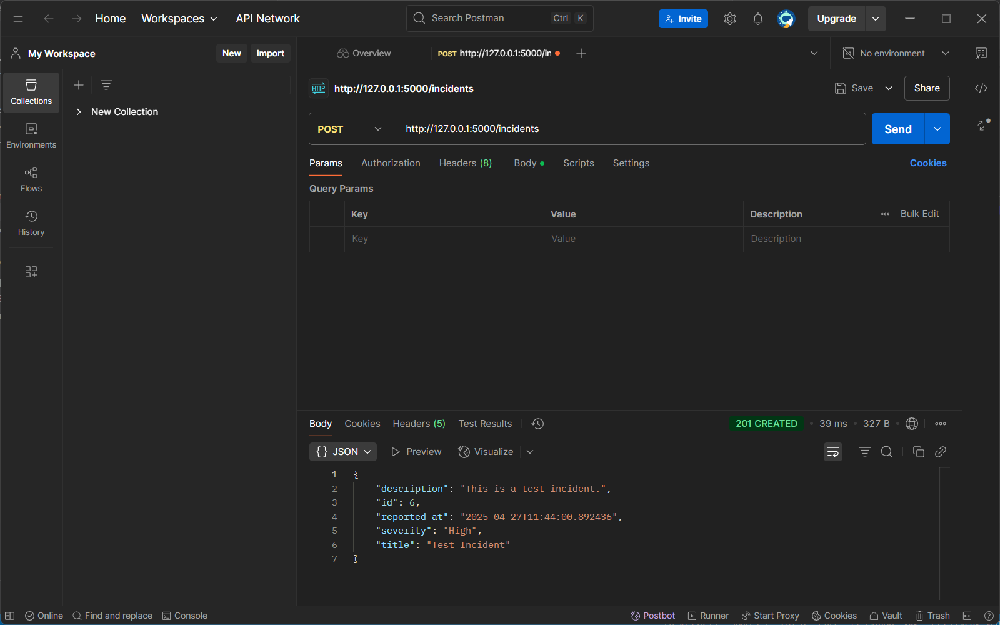
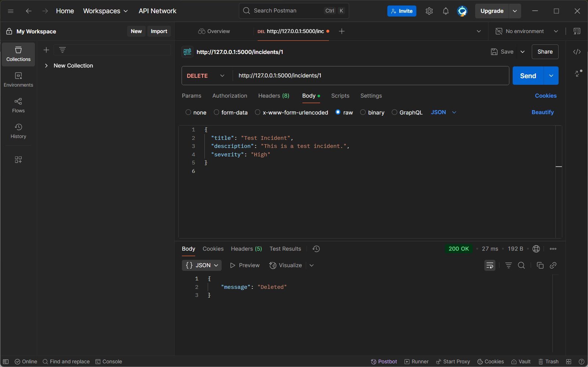
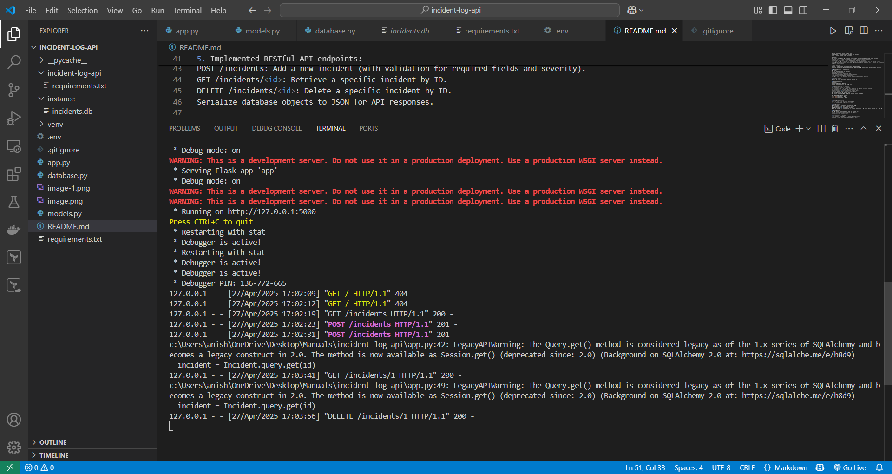

Title : AI Safety Incident API

TechStack : 
Python	Programming language
Flask	Web framework for RESTful API
SQLAlchemy	ORM for database operations
SQLite	Database for storing incident data
python-dotenv	Loads environment variables from .env file
venv	Manages isolated Python environment

Abstract :
The project is a RESTful API built with Flask (Python) for logging and managing AI safety incidents.
It allows users to create, view, and delete incident records through HTTP endpoints.
Incident data is stored in a SQLite database using SQLAlchemy as the ORM.
There is no web page or frontend; all interaction is via API endpoints using tools like Postman or curl.
Visiting the root URL / shows a "Not Found" page, which is expected because no route is defined for /-the API is meant to be accessed at endpoints like /incidents.

Project Workflow : 
1. Environment Setup
Created a Python virtual environment (venv) and activated it
Installed dependencies: Flask (web framework), SQLAlchemy (ORM), python-dotenv (for environment variables)

2. Project Structure & Configuration
Key files:
app.py: Main application and API logic
models.py: Database model
database.py: Script to seed initial data
.env: Stores environment variables (like database URL)
requirements.txt: Lists project dependencies
Configure Flask to use SQLite (or another database) via environment variables

3. Database Modeling
Defined the Incident model in models.py using SQLAlchemy:
Fields: id, title, description, severity, reported_at.

4. API Implementation
In app.py:
Initialize Flask and SQLAlchemy.
Created database tables if they don’t exist.

5. Implemented RESTful API endpoints:
GET /incidents: Retrieve all incidents.
POST /incidents: Add a new incident (with validation for required fields and severity).
GET /incidents/<id>: Retrieve a specific incident by ID.
DELETE /incidents/<id>: Delete a specific incident by ID.
Serialize database objects to JSON for API responses.

Use your browser for GET requests only.
Use curl or Postman for POST and DELETE requests to your Flask API.

Use POST and DELETE with Postman
 = POST
 = DELETE
 = Implementation

6. Running the Application
Start the Flask server by running python app.py.
The API is now live at http://127.0.0.1:5000.

7. Using the API
GET /incidents to list all incidents.
POST /incidents to create a new incident (send JSON).
GET /incidents/<id> to fetch a specific incident.
DELETE /incidents/<id> to remove an incident.
Note: The root URL (/) is not defined, so visiting it will show a 404 error; this is expected for a REST API.

8. Error Handling
The API returns appropriate error codes and messages for:
Missing fields or invalid severity (400 Bad Request).
Incident not found (404 Not Found).

9. Version Control & Deployment
Track code with Git and push to a remote repository (GitHub).
README.md provides setup, usage, and example API calls.

10. GitHub Link
https://github.com/anish-deploys/AI-Safety-Incident-API